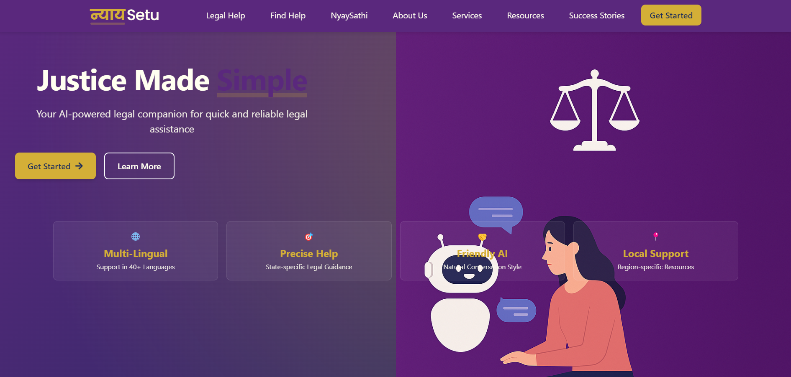
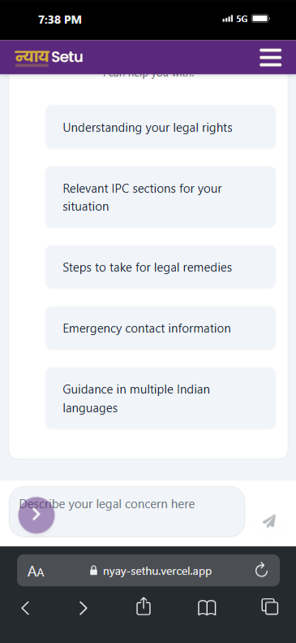
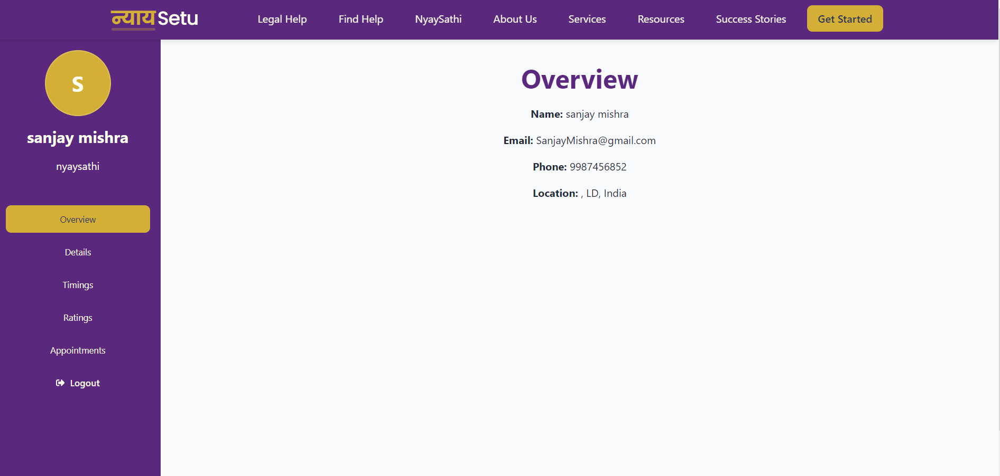
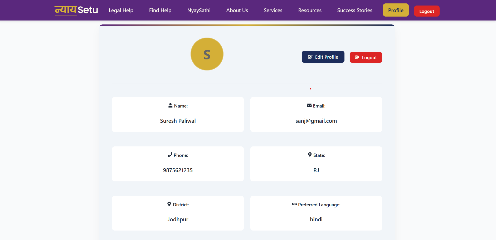
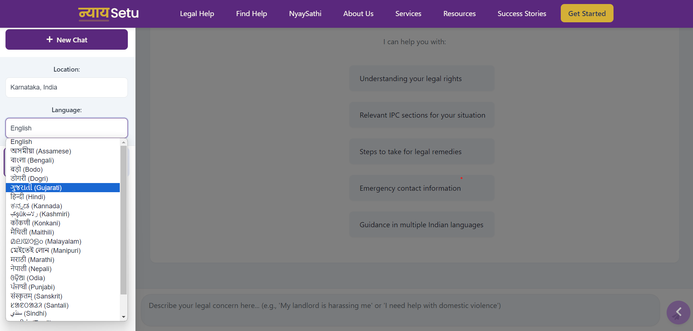
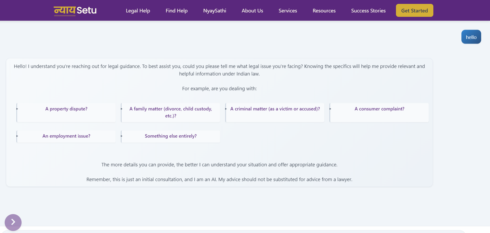
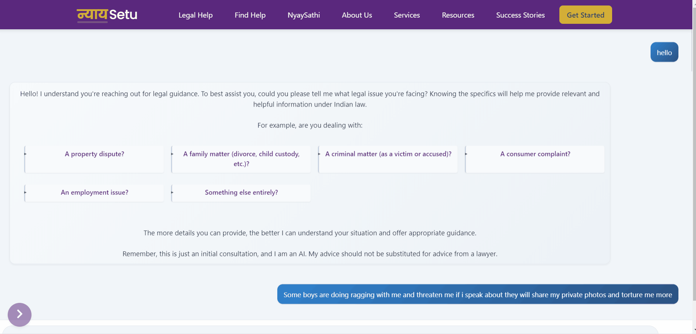
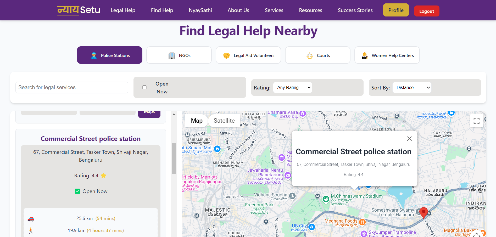
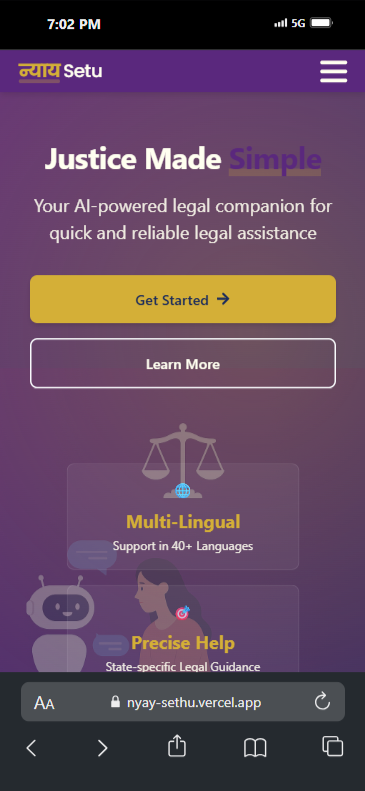

# ⚖️ NyaySathi
Empowering Justice with AI, Empathy, and Verified Legal Support


---

## 🗄️ Preview
NyaySathi – where technology meets justice.



---

## 🌐 Live Links
- 🚀 **Frontend:** [nyay-sathi.vercel.app](https://nyay-sathi.vercel.app)
- 🧠 **Backend API:** Hosted via Render / HuggingFace Spaces

---

## 🧐 About the Project
NyaySathi is a two-sided legal help platform combining:
- AI chatbot for IPC/legal guidance
- Verified lawyers, NGOs, judges, and professors (NyaySathis)
- Appointment scheduling & chat
- Legal education for the public
- SOS & emotion detection for emergency help

---

## ✨ Key Features
| Feature                     | Description |
|----------------------------|-------------|
| 🧠 AI Legal Assistant       | Real-time, multilingual legal help |
| 📚 IPC Section Finder       | FAISS + Gemini-based intelligent search |
| 🗕️ Appointment Scheduler    | Two-step dynamic appointment form |
| 👨‍⚖️ Verified NyaySathi     | Role-based signup and dashboard |
| 💬 Chat Integration         | User ↔ NyaySathi messaging |
| 💾 Legal Education          | Static and animated tutorials |
| 📱 Responsive Design        | Mobile-first experience |
| 🚘 SOS & Emotion Detector   | Alerts for serious queries |

---

## ⚙️ Tech Stack
| Layer        | Tools Used |
|--------------|------------|
| **Frontend** | React.js, Tailwind CSS, Vercel |
| **Backend**  | Flask, JWT, REST APIs |
| **AI Layer** | Gemini Pro, FAISS (local vector search) |
| **Database** | MongoDB or SQLite |
| **Deployment** | Vercel (Frontend), Render/HuggingFace (Backend) |

---

## 🧐 AI Chat System
Our Gemini + FAISS-powered bot helps users understand the legal situation and guides them with IPCs and next steps.



---

## 🗕️ Appointments & Profiles
### 👨‍⚖️ NyaySathi Profile View
Verified expert dashboard with credentials and case activity



### 👤 User Profile View
Track case progress, chat, and feedback



---

## 📘 Legal Help – Multilingual AI Assistance
### 🗣️ Step 1 – Choose Your Language
NyaySathi supports all 22 official Indian languages. Users can pick any language for help, and the system adapts instantly.



### 🧠 Step 2 – AI Begins the Conversation
The chatbot responds in the selected language. This image shows a subset of actual conversation in action.



### 🎥 Learn Your Rights with Tutorial GIF
Visual guide for legal awareness and actions.



---

## 🧭 Find Help Page
Smartly recommends nearby and categorized legal support systems:
- 👮‍♂️ Police Stations
- 🏢 NGOs
- 🤝 Legal Aid Volunteers
- ⚖️ Courts
- 👩‍⚖️ Women Help Centers



---

## 📱 Mobile View Support
Optimized for accessibility on smaller screens.




---

## 📁 Project Structure
```
nyay-sathi/
├── client/
│   ├── pages/
│   ├── components/
│   ├── public/Resources/
│   └── App.js
├── backend/
│   ├── routes/
│   ├── models/
│   ├── faiss_engine.py
│   └── app.py
└── README.md
```

---

## 🔧 Local Setup
```bash
# Clone repository
git clone https://github.com/your-username/nyay-sathi.git
cd nyay-sathi

# Frontend setup
cd client
npm install
npm run dev

# Backend setup
cd ../backend
pip install -r requirements.txt
python app.py
```

.env file (backend):
```
JWT_SECRET=your_secret_key
GEMINI_API_KEY=your_gemini_key
```

---

## 🔮 Future Roadmap
- 🎤 Voice-to-Text for Hindi Queries
- 📃 FIR Decoder + PDF Parser
- 📊 Admin Analytics Panel
- 📞 Video Calling with NyaySathi
- 🧠 Agent-style LangGraph AI flows

---

## 🤝 Contributing
Fork, edit, and submit a PR. See CONTRIBUTING.md for more.

---

## 📜 License
This project is the intellectual property of [Nyay Sethu].

© 2025 [Suresh Paliwal]. All rights reserved.

Unauthorized use, copying, distribution, or reverse engineering of this software, in part or full, is strictly prohibited. This software is intended for internal evaluation and private deployment only.

For commercial use or licensing inquiries, please contact: [sanj35814@gmail.com]


---

> ⭐ Loved the project? Star this repo and share it with your friends!